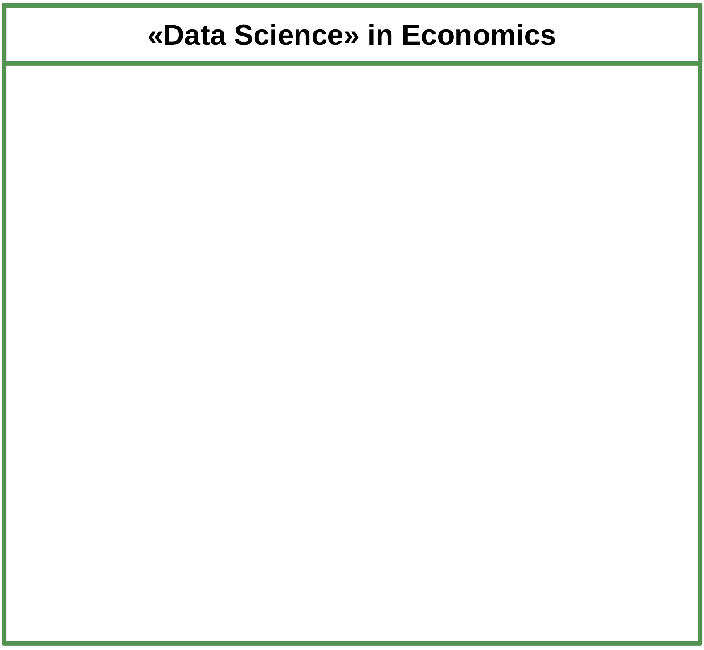
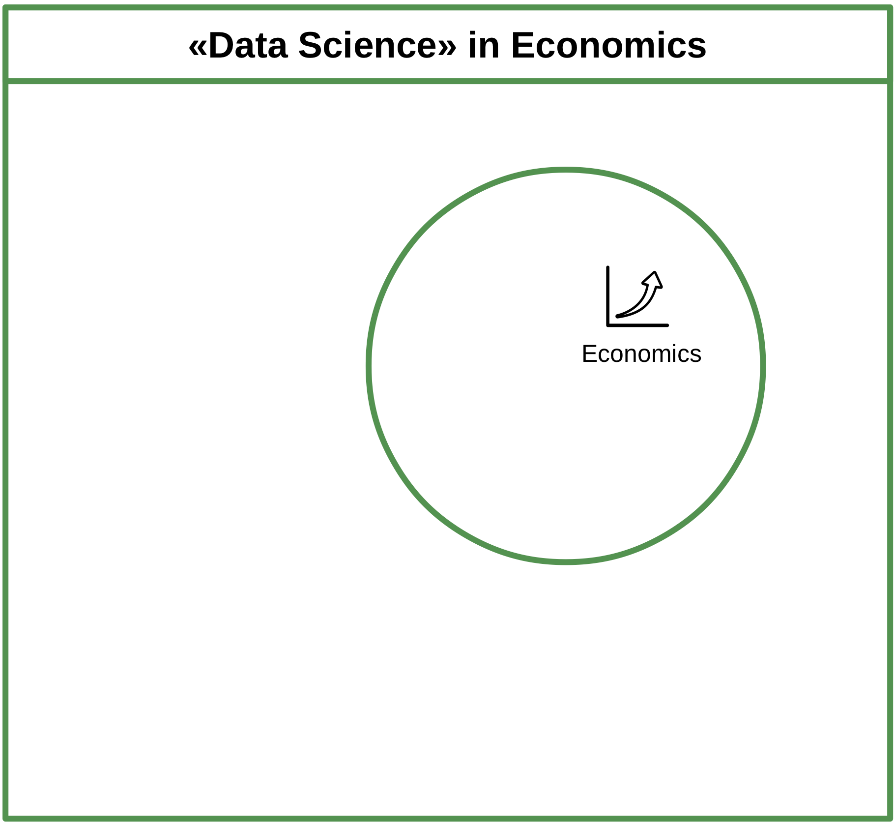
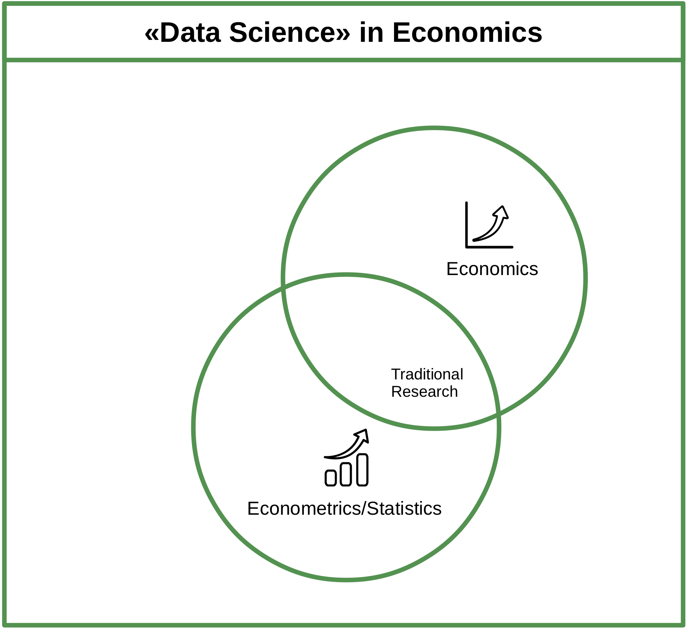
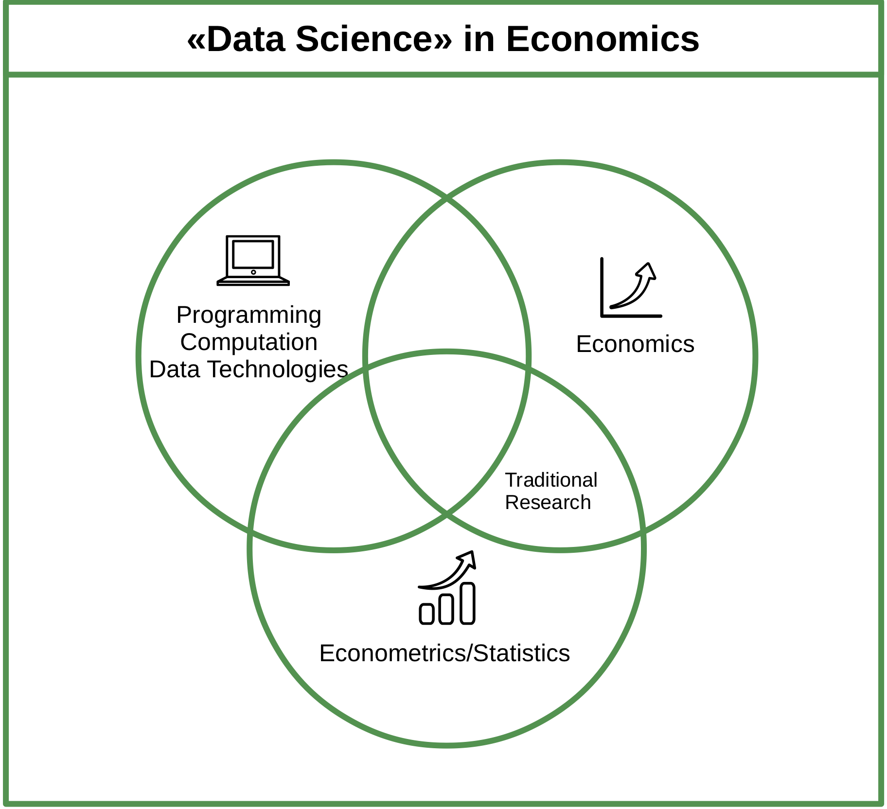
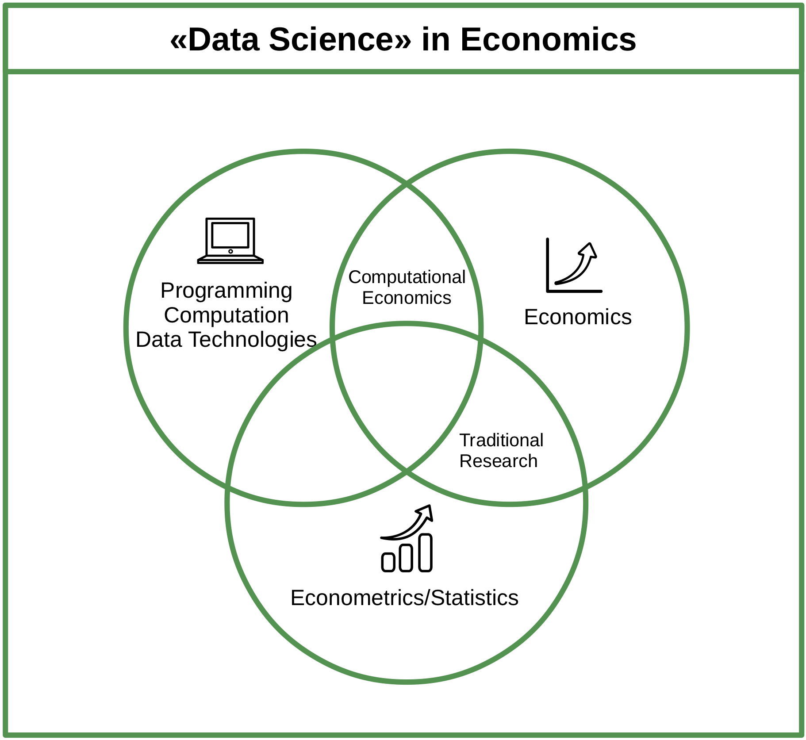
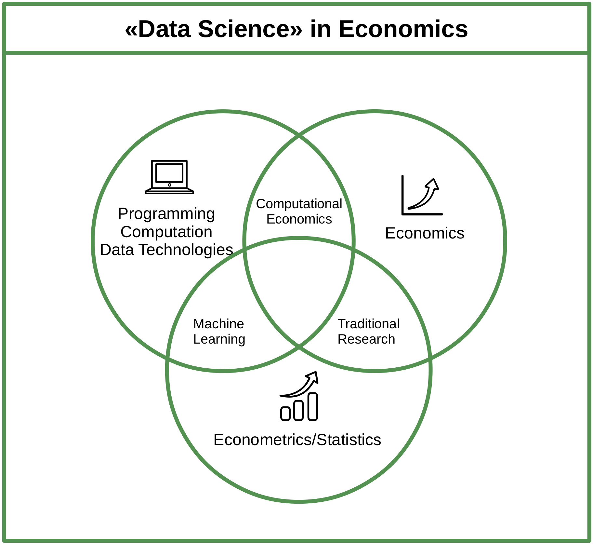
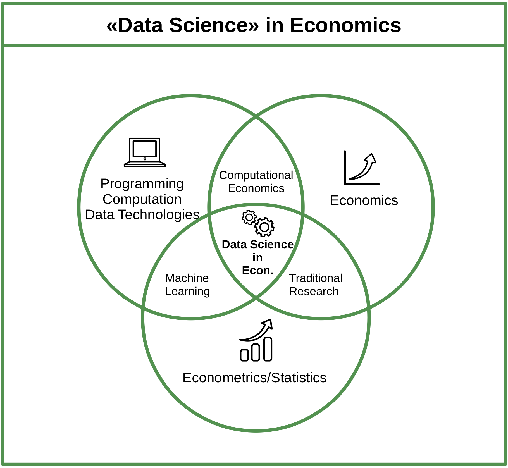
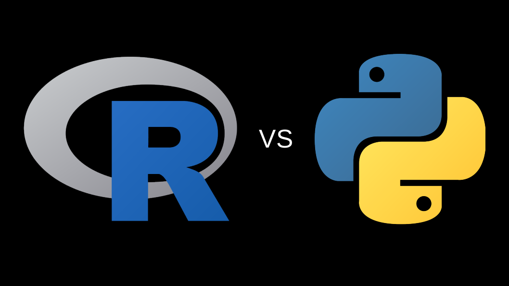
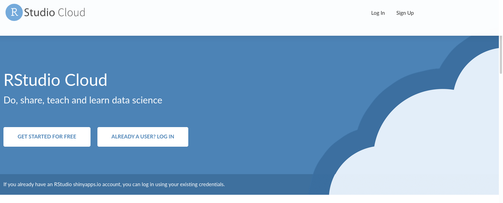

<style>
pre {
     font-size: 20px
}
</style>


```{r set-options, echo=FALSE, cache=FALSE}
options(width = 100)
library(knitr)
```

## Welcome to A Brief Introduction to Programming with R!

- Fire up your notebooks!
- Go to this page: https://umatter.github.io/courses
- Under 'A Brief Introduction to Programming with R' you'll find all material of this course.

## Our Team - At Your Service


|   |   |   |
|:-:|:-:|:-:|
|   |   |   | 
| Thomas Aeschbacher  |  Jan Serwart  | Ulrich Matter  |
| (TA) |  (JS)  | (UM)  |


## The Plan for Today

- 09:15-10:00 *Introduction, Background, Tools* (UM [TA, JS])
- 10:00-10:15 *Break, support with installations* (UM, TA, JS)
- 10:15-11:00 *Exercises, First Steps with R* (TA, JS)
- 11:00-11:15 *Break, Q&A* (TA, JS)
- 11:15-12:00 *First Steps with R, Concepts* (TA, JS)
- 12:00-13:15 *Lunch (individually)*
- 13:15-14:00 *Exercises* (TA, JS)
- 14:00-14:15 *Break, Q&A* (TA, JS)
- 14:15-15:00 *Working with Data* (UM [TA, JS])

---

```{r help, echo=FALSE, out.width = "70%", fig.align='center', purl=FALSE}

```


# Why learn to program (now)?

## Background: Technological change


```{r computers, echo=FALSE, out.width = "90%", fig.align='center', purl=FALSE}
include_graphics("../img/computers.jpg")
```


## Background: Technological change


```{r newoil, echo=FALSE, out.width = "45%", fig.align='center',  purl=FALSE}
include_graphics("../img/economist_oildata.png")
```

## Background: Technological change


```{r airevolution, echo=FALSE, out.width = "90%", fig.align='center',  purl=FALSE}
include_graphics("../img/AIrevolution.png")
```


## Perspective: Data Science and Economics

```{r dsdiagram1, echo=FALSE, out.width= "65%", fig.align='center',  purl=FALSE}

```

----


```{r dsdiagram2, echo=FALSE, out.width = "65%", fig.align='center',  purl=FALSE}

```

----


```{r dsdiagram3, echo=FALSE, out.width = "65%", fig.align='center',  purl=FALSE}
include_graphics("../img/venn_diagramm_03.png")
```

----


```{r dsdiagram4, echo=FALSE, out.width = "65%", fig.align='center',  purl=FALSE}

```

----


```{r dsdiagram5, echo=FALSE, out.width = "65%", fig.align='center',  purl=FALSE}

```

----


```{r dsdiagram6, echo=FALSE, out.width = "65%", fig.align='center',  purl=FALSE}

```

----


```{r dsdiagram7, echo=FALSE, out.width = "65%", fig.align='center',  purl=FALSE}

```

----


```{r dsdiagram8, echo=FALSE, out.width = "65%", fig.align='center',  purl=FALSE}

```


## Reasons beyond current developments
 - Programming is an exercise in elementary logic. 
 - Better understand the problem at hand.
 - "Programming is like magic!" (Aaron Swartz)


# Why R?

---

```{r echo=FALSE, fig.align='center', out.width="75%"}

include_graphics("../img/R_logo.svg.png")

```


## The 'data language'
- Widely used in Data Science jobs.
- Particularly useful to program with data.

```{r echo=FALSE, fig.align='center', out.width="55%"}



```

- Originally designed as a tool for *statistical analysis*.


## High-level language
- Relatively easy to learn.
- A lot free tutorials, [cheatsheets](https://rstudio.com/resources/cheatsheets/), and support online.

<center>

[](https://stackoverflow.com/questions/tagged/r)

</center>


## Free, open source, large community
- Used in various fields.
- Thousands of 'R-packages' covering diverse aspects of data analysis.
- Learn from open sources.

```{r}
library(ctv)
available.views()
```


# The Tools


## R

```{r echo=FALSE, fig.align='center', out.width="55%"}

include_graphics("../img/R_logo.svg.png")

```
Install R from [here](https://stat.ethz.ch/CRAN/)!


## RStudio

```{r echo=FALSE, fig.align='center', out.width="45%"}

include_graphics("../img/rstudio.png")

```
Install RStudio from [here](https://www.rstudio.com/products/rstudio/download/#download)!


## RStudio Cloud

```{r echo=FALSE, fig.align='center', out.width="95%"}



```

- Register [here](https://rstudio.cloud/) for free!
- Note: feel free to use this for today's course if you currently have problems with the local R/RStudio installation.
- Hint: free exercises that build/extend on what we cover today!

 

# Exercises

## Exercise A: Setting up a Working Environment {.smaller}

 1. Open RStudio and get familiar with the file browser pane on the lower right. Navigate to a folder on your hard disk in which you want to work throughout this course (and store all the code you write in this course).

 2. Use the 'New Folder'-button to create a new folder. Name this new folder `r_course`. 

 3. You should see the new folder listed in the file browser. Click on it to navigate to its contents (so far empty). Now, click on the 'More' button and select 'Set as Working Directory' in the drop-down menu.

 4. Again, use the 'New Folder'-button in order to create two new folders called `data` and `code`.

 5. Finally, click on the project button in the top-right corner of the RStudio window () and select 'New Project' in the drop-down menu. In the pop-up window, select 'Existing directory', browse to and select your `r_course` folder, then click 'Create Project'.

Now you know how to set up a meaningful basic folder structure and working environment for an R project. The next exercise teaches you how to write R scripts in this environment.


## Exercise B: R Scripts {.smaller}

1. Switch to the R console and type the following line of code and hit enter (see example from above).

```{r eval=FALSE, purl=FALSE}
print("Hello world")
```
You should see the words `"Hello world"` printed on screen. This is the usual way of working with R in an interactive session. However, as pointed out above, in most circumstances it makes sense to write the R code to an R script (in order to store and document it) and then execute the code from there.

2. In the RStudio Menu-bar select `File/New File/R Script` to create a new file, shown/opened in the Script pane.

3. Type `print("Hello world")` to the first line of the script, and click on 'Run' () to execute the code in the console.


# Q&A


<style>
slides > slide { overflow: scroll; }
slides > slide:not(.nobackground):after {
  content: '';
}
</style>

