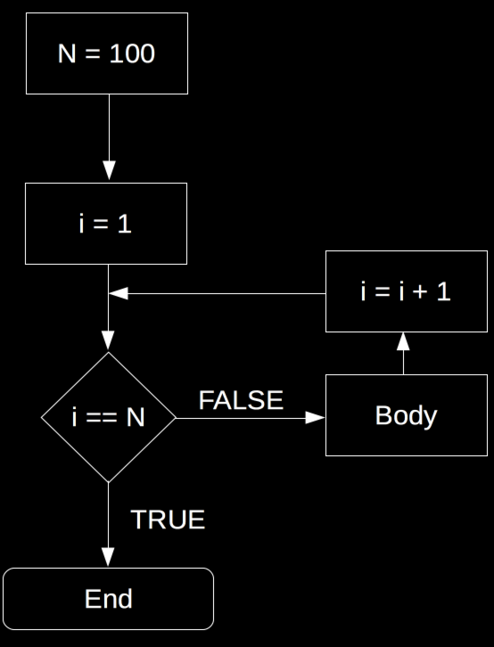
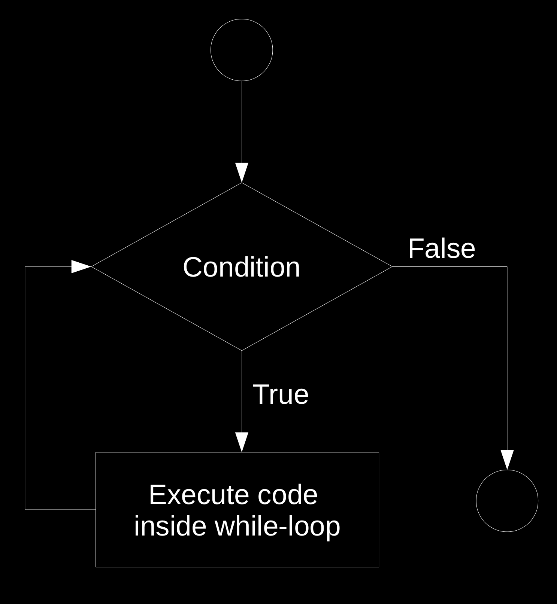

<style>
pre {
     font-size: 20px
}
</style>


```{r set-options, echo=FALSE, cache=FALSE}
options(width = 100)
library(knitr)
```

# First Steps in R

## Variables and Vectors
'Assign the numeric value `2` to variable `a`':
```{r}
a <- 2
```
Type `a` and hit enter (Prints the value of a variable to screen)
```{r}
a
```

## Variables and Vectors
Initiate an integer vector `a`
```{r}
a <- c(10, 22, 33, 22, 40)
```
Give names to the vector's elements
```{r}
names(a) <- c("Andy", "Betty", "Claire", "Daniel", "Eva")
```


## Indexing
By number of element (R starts counting with 1!) 
```{r}
a[3]
```
By the element's name
```{r}
a["Claire"]
```

## Inspect variables/vectors ('R objects')
See what 'class' an object belongs to
```{r}
class(a)
```
Get a summary of its structure
```{r}
str(a)
```


## Math Operators {.larger}

| Math Symbol | R Syntax|
|:-------------:|:----------:|
| $+$ | `+` |
| $-$ | `-` |
| $\times$ |  `*`|
| $\div$  | `/`|

## More Math
| Math Symbol | R Syntax|
|:-------------:|:----------:|
|$a^n$| `a^n`|
|$\sqrt{a}$| `sqrt(a)`|
|$\ln{a}$| `log(a)`|
|$e^n$| `exp(n)`|
|Euler's number| `exp(1)`|
|$\pi$| `pi`|


# Basic Programming Concepts

## Loops
- Repeatedly execute a sequence of commands.
- Known or unknown number of iterations.
- Types: 'for-loop' and 'while-loop'.
     - 'for-loop': number of iterations typically known.
     - 'while-loop: number of iterations typically not known.

## for-loop

```{r echo=FALSE, fig.align='center', out.width="45%"}

```

## `for`-loop in R

```{r eval=FALSE}
# number of iterations
n <- 100
# start loop
for (i in 1:n) {

     # BODY
}

```

## `for`-loop in R

```{r}
# vector to be summed up
numbers <- c(1,2,3,4,5)
# initiate total
total_sum <- 0
# number of iterations
n <- length(numbers)
# start loop
for (i in 1:n) {
     total_sum <- total_sum + numbers[i]
}

```

## Nested `for`-loops

```{r eval=FALSE}
# number of iterations in outer loop
n <- 100
# start outer loop
for (i in 1:n) {

     # number of iterations in inner loop
     m <- 4
     # start inner loop
     for (j in 1:m) {

          # BODY
     }
}

```


## while-loop

```{r while, echo= FALSE, fig.align="center", out.width="60%"}

```

## `while`-loop in R

```{r eval=FALSE}
# initiate variable for logical statement
x <- 1
# start loop
while (x == 1) {

     # BODY
}

```

## `while`-loop in R

```{r}
# initiate starting value
total <- 0
# start loop
while (total <= 20) {
     total <- total + 1.12
}

```


## Booleans and Logical Statements
```{r}
2+2 == 4
3+3 == 7
4!=7

```


## Booleans and Logical Statements
```{r}

condition <- TRUE

if (condition) {
     print("This is true!")
} else {
     print("This is false!")
}


```


## Booleans and Logical Statements
```{r}

condition <- FALSE

if (condition) {
     print("This is true!")
} else {
     print("This is false!")
}


```


## R Functions

- $f:X \rightarrow Y$
- 'Take a variable/parameter value $X$ as input and provide value $Y$ as output'
- For example, $2\times X = Y$.
- R functions take 'parameter values' as input, process those values according to a predefined program, and 'return' the results.

## R Functions

- Many functions are provided with R.
- More can be loaded by installing and loading packages.

```{r eval=FALSE, purl=FALSE}
# install a package
install.packages("<PACKAGE NAME>")
# load a package
library(<PACKAGE NAME>)
```


## Define your own functions

Example: compute the mean

- Use the built-in functions to sum up the elements in a vector (`sum()`)
- and to get the number of elements in a vector (`length()`)
```{r}

# compute the mean in one line
sum(a) / length(a)

```


## Define your own functions

Example: compute the mean
```{r}
# define our own function to compute the mean, given a numeric vector
my_mean <- function(x) {
     x_bar <- sum(x) / length(x)
     return(x_bar)
}


```


## Define your own functions

Example: compute the mean
```{r}
# test it
my_mean(a)

# compare it with the built-in function
mean(a)

```


# Data Structures and Indices

## Vectors and Lists
```{r}
# A vector containing numeric (or integer) values
integer_vector <- 9:20
integer_vector[2]
integer_vector[2:5]

# A string vector ('a vector containing text')
string_vector <- c("a", "b", "c")
string_vector[-3]


```


## Vectors and Lists
```{r}

# Lists
# A list can contain different types of elements, 
# for example a numeric vector and a string_vector
mylist <- list(numbers = integer_vector, letters = string_vector)
mylist


```


## Vectors and Lists

We can access the elements of a list in various ways:
 
 - with the element's name
```{r eval=FALSE}
mylist$numbers
mylist["numbers"]
```

 - via the index
```{r eval=FALSE}
# access a list element with []
mylist[1]
# with [[]] we can access directly the content of the element
mylist[[1]]
```


## Matrices and Data Frames
```{r }

# matrices
mymatrix <- matrix(integer_vector, nrow = 4)

```

```{r eval=FALSE}
# get the second row
mymatrix[2,]
# get the first two columns
mymatrix[, 1:2]
```

## Matrices and Data Frames
```{r eval=TRUE}
# data frames ("lists as columns")
mydf <- data.frame(Name = c("Alice", "Betty", "Claire"),
                   Age = c(20, 30, 45))
mydf

```

## Matrices and Data Frames
```{r eval=FALSE}
# select the age column
mydf$Age
mydf[, "Age"]
mydf[, 2]
# select the second row
mydf[2,]

```


## Classes and Data Structure

Have a look at what kind of object you are dealing with
```{r}
class(mydf)
class(mymatrix)

```

Have a closer look at the data structure
```{r}
str(mydf)
```


# Exercises

## Exercise A: Write a Sum Function {.smaller}

In the code example above, introducing the for-loop, you see how we can use such a loop to sum up numbers stored in a numeric vector. Use this code example and the following empty function construct to implement a function that takes a numeric vector as input and returns the sum of the vector's elements.

```{r eval=FALSE, purl=FALSE}
my_sum <- 
     function(x){
          
     }

```

Test your function by comparing its output with the output of `sum()` (the pre-implemented sum function in R) when calling it with the same input. 


## Exercise B: Robustness and Warnings {.smaller}
Once you have implemented and successfully tested `my_sum()`, see what happens if you call it with the following vector as input

```{r}
numbers2 <- c("1", "2", "3")
```


Why do we get an error? Investigate by comparing the vector `numbers` from the code example above with the new vector `numbers2` (the functions `str()` and `class()` might help you).

Extend your `my_sum()` function with a control statement that checks whether the input is of the right class for the function to work (Hint: `class(x)!="numeric"`). The goal is to make the function more robust to wrong input. That is, if the input is wrong, issue a warning but don't break down with an error. Use the following code for the warning message:

```{r eval=FALSE, purl=FALSE}
warning("Wrong input! This function only accepts numeric or integer values!")
```

Test your enhanced sum function with the two input vectors `numbers` and `numbers2`.


## Exercise C: Standard Deviation Function {.smaller}
In the example above we've implemented our own R function to compute the mean, given a numeric vector (with the help of already implemented R functions (`length()` and `sum()`; alternatively use your own `my_sum()`). Now implement an R function called `my_sd` that computes the standard deviation 

$SD = \sqrt{\frac{1}{N-1} \sum_{i=1}^N (x_i - \overline{x})^2}$.

(Hint: see the math operators section above for some of the ingredients).

Test your implementation by comparing its results with the already implemented `sd()` function.


## Exercise D: Standard Error Function {.smaller}
Building on the function written in Exercise C, implement a function to compute (the estimate of) the sample mean standard error as defined here:

$\text{SE}_{\bar{x}} = \frac{SD}{\sqrt{n}}$. 

Hint: the idea is to use your own implementation (in Exercise C) to compute $SD$ as a first step of your standard error function. 

Exercises C and D should illustrate how you can approach more complex problems by breaking them up in smaller problems and addressing each of these step-by-step. That is, when looking at the problem of computing $\text{SE}_{\bar{x}} = \frac{SD}{\sqrt{n}}$, you see that computing $SD$ is a part of the overall problem, which can be addressed separately.

## Exercise E: T-test 
Implement a function for the one-sample [t-test](https://en.wikipedia.org/wiki/Student%27s_t-test):

$t = \frac{\bar{x} - \mu_0}{\frac{SD}{\sqrt{n}}}$.

## Exercise F: Fibonacci Sequence

In mathematics, the Fibonacci sequence is composed of a sequence of numbers, where each succeeding number is the sum of the two preceding ones. The first two numbers of the sequence are defined as $F_0=0$ and $F_1=1$, respectively. Following numbers are given by $F_n=F_{n-1}+F_{n-2}$, for $n>1$.

Your task is now to obtain the first 30 numbers of the Fibonacci sequence. To do so, first create an empty vector of size 30 (empty referring to you placing 30 $NA$ values into a vector; hint: type ?rep in the R console on how to replicate values in R). Then, replace the first two $NA$ values in the created vector with the corresponding starting values $F_0=0$ and $F_1=1$, respectively. Following, write a for-loop to calculate the remaining 28 numbers of the sequence, at each iteration replacing the $NA$ value in the vector with the corresponding correct Fibonacci number.


